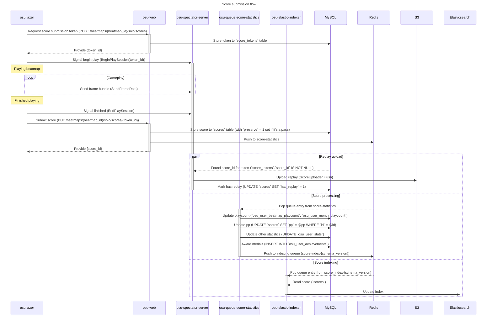
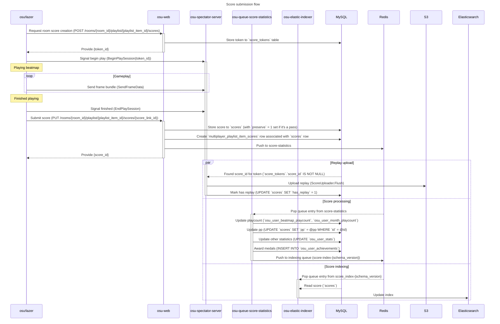

# Current score submission flow

## Solo



## Multiplayer

The multiplayer score submission flow is in a large part similar to the solo submission flow, except for interacting with different API endpoints. There's also an extra table involved in order to link scores to multiplayer rooms (`multiplayer_playlist_item_scores`).



# Current usage stats

As of 2023-08-17:

```sql
mysql> select count(*) from solo_scores;
+------------+
| count(*)   |
+------------+
| 2380500256 |
+------------+
1 row in set (2 hours 46 min 28.36 sec)

mysql> select count(*) from solo_scores where preserve = 1;
+------------+
| count(*)   |
+------------+
| 2306532757 |
+------------+
1 row in set (37 min 43.92 sec)

mysql> select count(*) from solo_scores where data->"$.legacy_score_id" is not null;
+------------+
| count(*)   |
+------------+
| 2305803972 |
+------------+
1 row in set (7 hours 7 min 41.72 sec)

mysql> select count(*) from solo_scores where data->"$.legacy_score_id" is null;
+----------+
| count(*) |
+----------+
| 75388822 |
+----------+
1 row in set (7 hours 4 min 34.84 sec)

mysql> select user_id, count(id) from solo_scores where preserve = 1 group by user_id order by count(id) desc limit 10;

+---------+-----------+
| user_id | count(id) |
+---------+-----------+
| 4937439 |    114526 |
| 9217626 |    109493 |
| 7807460 |    108895 |
| 2927048 |    107569 |
| 3172980 |    104732 |
| 7635621 |    103095 |
|  647309 |     99689 |
| 4781004 |     91402 |
|   47844 |     89986 |
| 4568537 |     86693 |
+---------+-----------+
```

# New score infrastructure

This document aims to cover the current structure of score submission from an infrastructure perspective, with the goal of moving towards consolidating the future (lazer) and present (osu-stable) into some kind of combined leaderboard.

This is a third version of the document, written after having deployed the bulk of the changes required to launch lazer leaderboards.

## Shortcomings of current system

### Score ID spaces overlap for different rulesets

Because we store each ruleset's scores in a separate table with `autoincrement`, scores from different rulesets may have the same ID. Additionally, as we eventually plan to introduce new rulesets this limits the scalability of the system.

### Score submission is synchronous

The majority of the score submission process is currently synchronous. Going forward the plan is to split things out into individual queue processors for different pieces of the puzzle, and keep the ingest as simple as possible to ensure high throughput and ease of scalability.

Firstly, let's look at all the things which currently happen in the average score submission:

- osu-stable sends a request to osu-web-10
- osu-web-10 receives the score
    - checks user authentication
    - queues score for validity check (osu token processor queue)
    - foreach spotlight / ranking target
        - update basic stats and store 24h rolling score entry
        - if the score is a pass
            - check medal unlocks
            - if the score is a new user high
                - store permanently in high scores table
                - wait for x ms for `score_process_history` to be populated by `osu-queue-score-statistics`
                    - This covers the import and processing of the legacy score in the new systems, which now handle user total PP updates.
    - return updated statistics to the user, one row per leaderboard, including pp if available

## New infrastructure

This section outlines each piece of the new infrastructure which needs to come online, in a roughly chronological order to allow for a both systems to operate in parallel for a period of time. This will allow us to ensure nothing has been forgotten, and potentially make changes (or reinitialise the new system from scratch) if required with no impact on the existing infrastructure.

### ✅ Add basic solo submission flow to lazer client

osu!(lazer) is already submitting scores via an osu-web endpoint. These are already being stored to the new `solo_scores` table.

Note that as these stores are not displayed anywhere, they are expendable. We can still reset the `solo_scores` table completely and not worry too much about these lazer-first scores. The only consideration is that if we do this, we cannot rollout new statistics processors on these scores. From that angle, we may want to avoid doing this until components like the medal processor have been rolled out.

### ✅ Add basic score storing to osu-web

As above, osu-web is already capable of storing scores to the new infrastructure.

### 🏃 Implement statistics processor components to update user profiles and history

Basic statistics which can be updated:

- Play count
- Level
- Total score
- Hit counts
- Recent plays
- Play time

Not yet supported:

- Medals

### ✅ Decide on storage method and structure

The latest iteration of the `scores` table structure looks as follows:

```sql
CREATE TABLE `scores` (
    `id`                  bigint unsigned     NOT NULL AUTO_INCREMENT,
    `user_id`             int unsigned        NOT NULL,
    -- ID of user who set the score.
    `ruleset_id`          smallint unsigned   NOT NULL,
    -- ID of ruleset in which the score was achieved.
    `beatmap_id`          mediumint unsigned  NOT NULL,
    -- ID of beatmap being played.
    `has_replay`          tinyint             NOT NULL DEFAULT '0',
    -- Whether the score has a replay. For lazer scores, managed by osu-server-spectator.
    `preserve`            tinyint             NOT NULL DEFAULT '0',
    -- Whether the score should should be preserved.
    -- Preserved scores are not deleted from the database; non-preserved are deleted after a week.
    -- Initial value is set to 1 by osu-web if the score is a pass, and 0 otherwise.
    -- This flag can be set at a later point e.g. if a score is pinned,
    -- or if it's part of a multiplayer room.
    `ranked`              tinyint             NOT NULL DEFAULT '1',
    -- Whether the score should show up on leaderboards.
    -- This is set to 0 for scores set by restricted users
    -- or for scores which were set on beatmaps whose leaderboards got wiped (e.g. qualified).
    -- Managed exclusively by osu-web.
    -- Notably, active mods do NOT influence the value of this flag,
    -- and whether a score gives PP or not is an orthogonal concern to it.
    `rank`                char(2)             NOT NULL DEFAULT '',
    -- Allowed values: F, D, C, B, A, S, SH, X, XH.
    `passed`              tinyint             NOT NULL DEFAULT '0',
    -- Whether the score is a pass.
    `accuracy`            float               NOT NULL DEFAULT '0',
    -- Accuracy as a fraction in the range [0,1].
    `max_combo`           int unsigned        NOT NULL DEFAULT '0',
    -- Maximum combo achieved by the player during the score.
    `total_score`         int unsigned        NOT NULL DEFAULT '0',
    -- The total number of points awarded to the score.
    `data`                json                NOT NULL,
    -- Contains extended information about the score:
    -- * `mods: APIMod[]` - list of mods used to set the score
    -- * `statistics: Dictionary<HitResult, int>` - numerical counts of hit results achieved
    -- * `maximum_statistics: Dictionary<HitResult, int>` - maximum numerical counts
    --    of hit results possible
    `pp`                  float               DEFAULT NULL,
    -- Number of pp points granted for the score.
    `legacy_score_id`     bigint unsigned     DEFAULT NULL,
    -- NULL for lazer scores.
    -- 0 for scores which have been imported from `osu_scores_*` (non-high) tables.
    -- Nonzero for scores which have been imported from `osu_scores_high_*` tables.
    -- Value points to the `osu_scores_high_*` row this score originated from.
    `legacy_total_score`  int unsigned        NOT NULL DEFAULT '0',
    -- Always 0 for lazer scores.
    -- Nonzero for stable scores; value is the total score prior to conversion to standardised.
    `started_at`          timestamp           NULL DEFAULT NULL,
    `ended_at`            timestamp           NOT NULL,
    `unix_updated_at`     int unsigned        NOT NULL DEFAULT (unix_timestamp()),
    -- Last update time of the row.
    `build_id`            smallint unsigned   DEFAULT NULL,
    -- ID of the build on which the score was set.
    PRIMARY KEY (`id`,`preserve`,`unix_updated_at`),
    KEY `user_ruleset_index` (`user_id`,`ruleset_id`),
    KEY `beatmap_user_index` (`beatmap_id`,`user_id`),
    KEY `legacy_score_lookup` (`ruleset_id`,`legacy_score_id`)
)
```

```sql
CREATE TABLE `score_tokens`
(
    `id`                bigint unsigned     NOT NULL AUTO_INCREMENT,
    `score_id`          bigint              DEFAULT NULL,
    `user_id`           bigint              NOT NULL,
    `beatmap_id`        mediumint           NOT NULL,
    `ruleset_id`        smallint            NOT NULL,
    `playlist_item_id`  bigint unsigned     DEFAULT NULL, 
    `build_id`          mediumint unsigned  DEFAULT NULL,
    `created_at`        timestamp           NULL DEFAULT NULL,
    `updated_at`        timestamp           NULL DEFAULT NULL,
    PRIMARY KEY (`id`)
);
```

- Tokens are temporary entries which mark the beginning of a new play. The primary purpose is to store information which is provided by the client at the beginning of the play which may not be conveyed again at final submission (or may be preferred to arrive sooner for validation purposes). It can also be used to obtain the wall clock time passed between start and end of the play (including pauses or delays in score submission).

```sql
CREATE TABLE `scores_process_history`
(
    `score_id`          bigint    NOT NULL,
    `processed_version` tinyint   NOT NULL,
    `processed_at`      timestamp NOT NULL DEFAULT CURRENT_TIMESTAMP ON UPDATE CURRENT_TIMESTAMP,
    PRIMARY KEY (`score_id`)
);
```

- Tracks processing of scores, currently by [osu-queue-score-statistics](https://github.com/ppy/osu-queue-score-statistics) exclusively. Allows for changes in processing to be reapplied to existing scores (as the processor can handle reverting and reapplying based on the `processed_version`).

### ✅ Create a new elasticsearch schema

Currently elasticsearch is used for user profile pages to get "user best" scores. Given that all score metadata is already loaded into elasticsearch, we could actually have been using it for more than this (taking some serious load off the database servers).

With the new table structure, the above becomes a *requirement*. All leaderboard lookups will need to be done via elasticsearch as there will be no means (index) to do so via mysql.

### ✅ Update osu-web to display scores using the new structure

As we are going to be running both systems alongside each other, the ability to display scores from the old and new table structure is required.

```
https://osu.ppy.sh/scores/osu/4049360982 <- old
https://osu.ppy.sh/scores/4049360982     <- new (doesn't require ruleset prefix)
```

Eventually old scores will be redirected to new scores using mapping data in `solo_scores_legacy_id_map`.

### ✅ Create a pump and ES population flow

Scores coming in via `osu-web-10` will need to populate into `solo_scores` in real-time. When this happens, we will also need to ensure that ES is made aware of new scores. Historically this has been done using the
[osu-elastic-indexer](https://github.com/ppy/osu-elastic-indexer) component – whether we update this to work with the new table or replace it with, for instance, hooks installed in osu-web API endpoints is yet to be decided.

### ✅ Add replay saving support for lazer scores

Replay data is now being handled by the `osu-server-spectator` component. It is only stored to disk for the time being, so further thought will be required at a later stage to persist things better.

---

At a later stage, this will need `osu-web` support, and further thought as to how we want to structure and store them. Legacy `osu_x_replays` tables will likely want to be replaced, using the new `score_id` and adding extra metadata to manage the lifecycle of the replay.

May be worth considering [requirements for ordering by most-watched](https://github.com/ppy/osu-web/issues/6412#issuecomment-1027539986) in the process.

### 🏃 Decide on purge mechanism for `scores`

As mentioned previously, we will want to clean up the `scores` tables in the case the `preserve` flag lets us know that a score is not being used anywhere.

Traditionally, non-high scores (ie. when a user's score did not replace their existing score on the same beatmap-ruleset-mod combination) would be inserted into a separate table which uses mysql partitioning to efficiently truncate rows older than 24 hours.

We will likely want to use partitioning again, which is going to require performance and structural considerations – mainly what are we partitioning over? `(preserve, date_format(updated_at, 'YYMMDD'))` may work but will also increase the size of the primary key.

### ✅ Import stable scores to new storage

An importer for this purpose has [been created](https://github.com/ppy/osu-queue-score-statistics/blob/master/osu.Server.Queues.ScoreStatisticsProcessor/Commands/Queue/ImportHighScoresCommand.cs)
. A test import was run on production in December, which took around 5 days (limited by threading of the importer, so can be vastly improved).

This import was to test compatibility mostly. We will need to reinitialise these scores once a linking table has been created, because as it stands there's no way to know which score relates to the original `score_id`s.

### ⏱ Implement and test score wiping (in case we need to remove scores for all lazer or specific lazer, etc.)

We should be able to, given one or more client version hashes, remove all related scores (and rollback relevant stats). This is something we haven't been able to do until now, which has limited the ability to have test runs of game-breaking changes or to limit rollback of bugs to only those scores submitted against the affected version(s).

`score_tokens` table contains `build_id` and the related `score_id` so wiping scores from specific version can already be done by querying it. The table is missing index for it though.

Make sure that this process can be run efficiently regardless of the size of the wipe.

### ⏱ Balancing, forward plans, etc.

There's a lot to discuss in terms of balancing and integration of the two score sources. Some that come to mind are:

- Figure out how to handle total score display (standardised vs classic)
- Discuss adding pp based sorting to leaderboards (and ensuring enough data is preserved to make this happen)
- Path to removing mod multipliers

### Statistics

For simplicity, these stats are *just for the osu! ruleset*. The overall number is around 30-40% higher than this.

24h Scores (stored regardless of pass/fail)
---------

- Scores ingested: 9,284,715
- Ingested scores which are non-fail: 1,864,121
- Storage size: 3.7gb
- Size per score: 237 bytes

Overall High Scores
---------

- Scores stored: 1,517,428,252
- Storage size: 230gb
- Size per score: 167 bytes
- Delta (24h): ~1,300,000 scores
